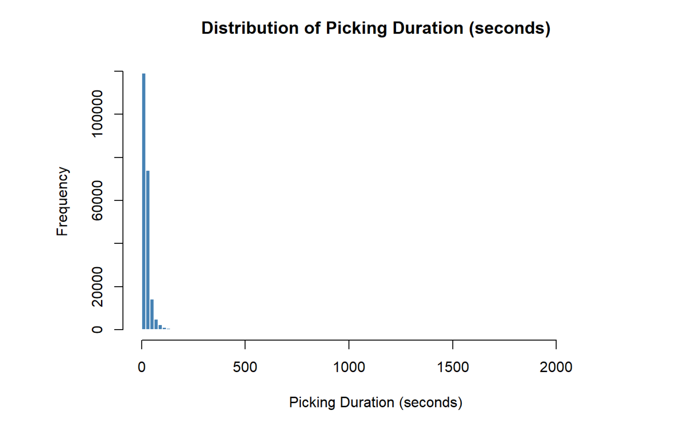
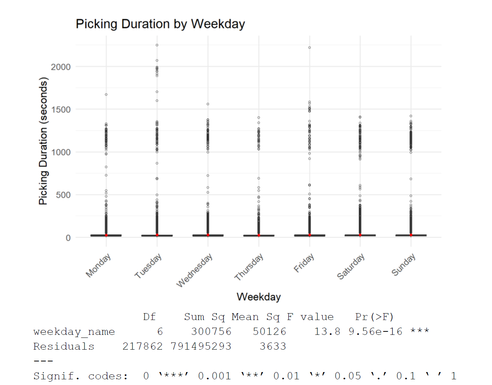
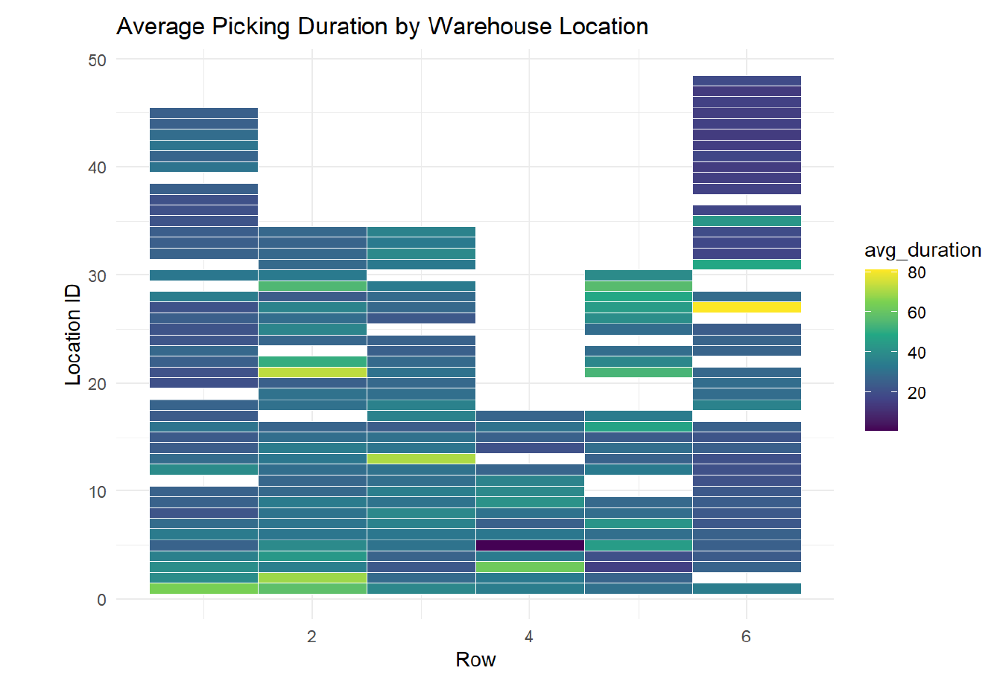
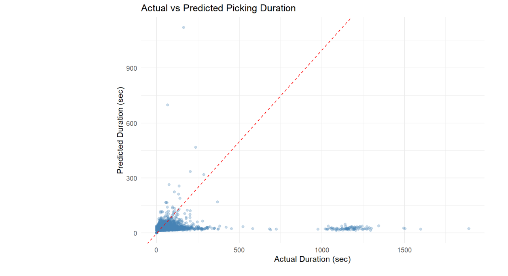
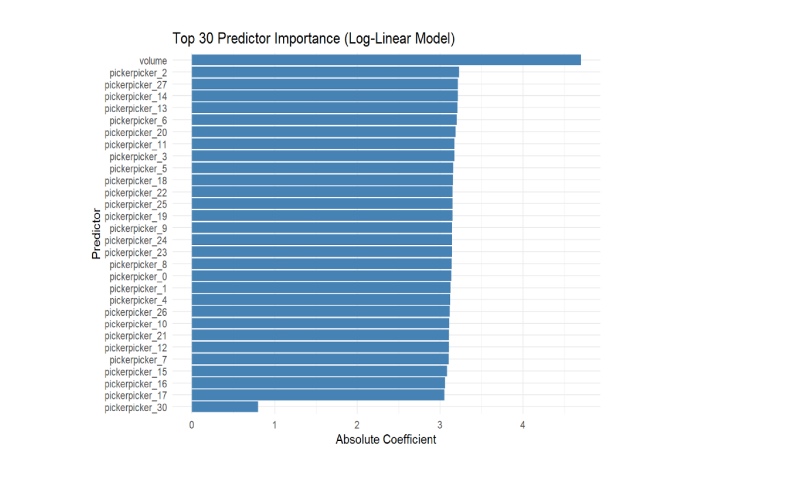
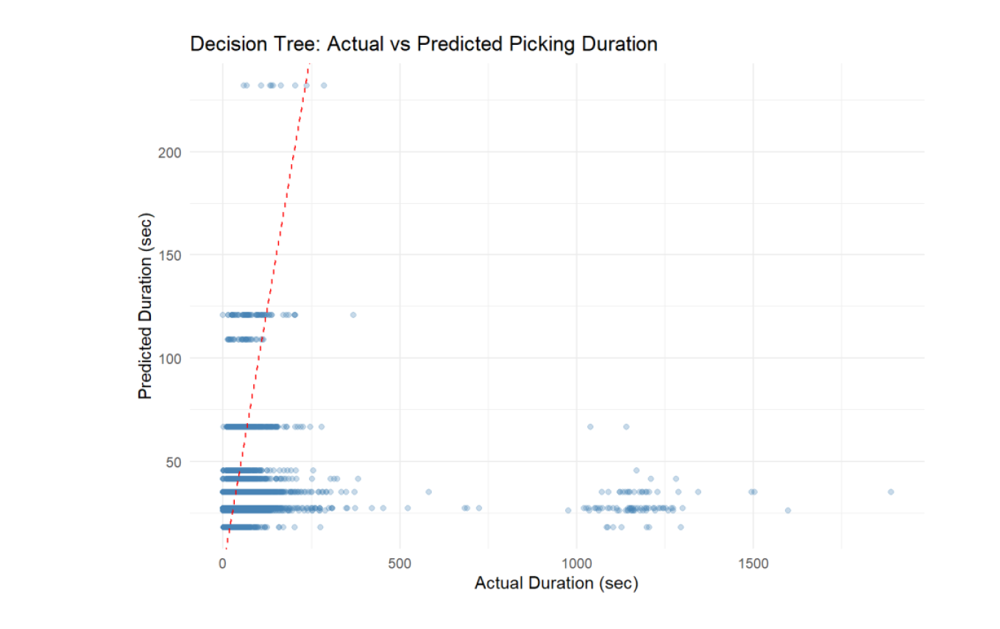
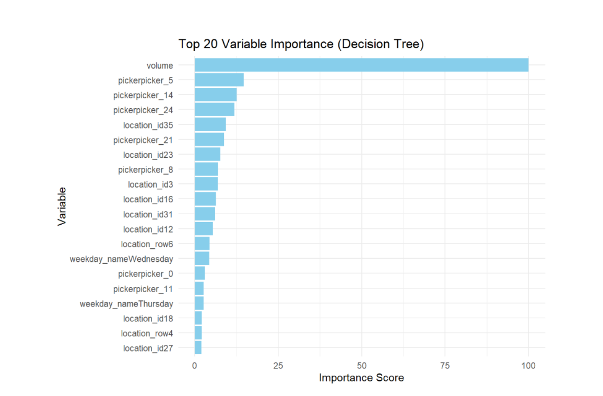

# 📦 Predicting Warehouse Picking Duration Using Machine Learning

## 📌 Project Overview

Fresh food warehouses operate under intense time pressure. Every night, thousands of items must be picked, packed, and shipped to stores before morning opening hours. If picking is delayed, the consequences are immediate such as higher labor costs, late deliveries, and potential product quality loss.

While observing warehouse operations, one key question emerged:

> Why do some picking tasks take significantly longer than others?

At first glance, picking seems simple, retrieve an item and move on. But in reality, picking time is influenced by multiple operational factors:  
- The **volume** of items being handled  
- The **worker’s efficiency and experience**  
- The **day of the week** (weekends vs weekdays)  
- The **physical warehouse layout** and item location  

Small inefficiencies such as congestion in certain aisles, heavier orders, or less experienced staff can accumulate into major operational bottlenecks.

To better understand this, I analyzed **217,963 real picking tasks** from a fresh food warehouse over a 20-day period. The goal was not just to build a predictive model but to uncover operational patterns and identify measurable drivers of picking duration.

This project combines exploratory data analysis and machine learning to:

- Quantify which factors most strongly influence picking time
- Compare linear and nonlinear modeling approaches
- Detect workforce and layout inefficiencies
- Generate actionable recommendations for warehouse management

Ultimately, this project demonstrates how data science can move beyond prediction and serve as a decision-support tool for operational optimization.

---

## 🗂 Dataset Overview

- 📊 217,963 picking tasks  
- 🌙 Night shift operations  
- 🏬 Fresh food warehouse  
- 📅 April 1 – April 20, 2023  

### 🎯 Target Variable
`picking_duration_sec`  
(Calculated using start_time and finish_time)

### 📈 Key Predictors
- Order **volume**
- **Picker ID** (anonymized)
- **Weekday**
- **Warehouse row**
- **Location ID**

### ⚙ Feature Engineering
- Extracted `location_row` and `location_id`
- Created `picking_duration_sec`
- Cleaned invalid volume values
- Generated weekday variable
- Log-transformed duration for regression
- Removed high-cardinality variables (`product_id`, `colli_id`)

---

# 🔎 Exploratory Data Analysis

## 1️⃣ Distribution of Picking Duration

**Key Findings:**
- Highly right-skewed distribution
- Most tasks completed under 100 seconds
- Some extreme values up to 2247 seconds
- Log transformation improved normality

👉 Important for regression assumptions and understanding task variability.

---

## 2️⃣ Weekday Differences

**Key Findings:**
- Saturday and Sunday shifts are significantly slower
- ANOVA test statistically significant (p < 0.001)

Possible reasons:
- Higher weekend demand
- Staffing differences
- More temporary workers

👉 Important insight for workforce planning.

---

## 3️⃣ Warehouse Layout Impact

**Key Findings:**
- Certain warehouse zones consistently slower
- Likely due to congestion or longer travel distances

👉 Suggests layout optimization opportunities.

---

# 🤖 Modeling Approach

Two supervised learning models were applied:

---

# 📊 Model 1: Multiple Linear Regression

Linear regression was selected because it is highly interpretable and clearly shows the direction and magnitude of each factor’s impact on picking duration. It allows us to quantify how variables like volume, weekday, or picker influence task time, making the results easy to explain in a business context. Additionally, it serves as a strong baseline model for comparing more complex approaches.

### Assumptions Checked
- Linearity
- Normality of residuals
- Homoscedasticity
- Multicollinearity (VIF < 2.5)

---

### 📈 Results

| Metric | Value |
|--------|--------|
| RMSE | 58.07 sec |
| MAE | 12.51 sec |
| Adjusted R² | 0.204 |

The model explains approximately **20% of variance** in picking duration.

### 🔥 Most Important Predictor

**Volume** was the strongest factor influencing picking duration.

Other significant factors:
- Picker performance
- Weekday
- Warehouse location

---

# 🌳 Model 2: Decision Tree Regression

Decision tree regression was chosen because it can capture nonlinear relationships and interaction effects between variables that linear models may miss. It visually illustrates how different factors combine to influence picking duration, making the results intuitive and easy to interpret from an operational perspective.

---

### 📈 Results

| Metric | Value |
|--------|--------|
| RMSE | 57.67 sec |
| R² | 0.022 |

✔ Slightly better RMSE  
❌ Low explanatory power  

The model performed better for short-duration tasks.

---

## ⚠ Data Imbalance

- 99.56% of tasks ≤ 200 seconds  
- Only 0.44% > 200 seconds  

This imbalance reduced performance for long-duration predictions.

---

# 📊 Feature Importance

Top predictors:
1. Volume
2. Picker
3. Location ID
4. Location row
5. Weekday

---

# 💡 Key Business Insights

### 📦 Volume Drives Picking Time
Larger orders significantly increase picking duration.

### 📅 Weekend Performance Drop
Consider assigning experienced pickers during weekend shifts.

### 👷 Worker Variability
Performance tracking and targeted training could improve efficiency.

### 📍 Layout Inefficiencies
Some warehouse zones were consistently slower, indicating possible congestion or inefficient slotting that should be reviewed and optimized.

---

# 🚀 Business Recommendations

- Balance high-volume orders across shifts
- Assign skilled workers during peak days
- Re-slot frequently picked products
- Monitor and train underperforming pickers
- Collect additional operational data (walking distance, product type, congestion levels)

---

# 🔮 Future Improvements

- Include product type feature
- Add travel distance data
- Apply Random Forest or Gradient Boosting
- Perform time-series seasonal analysis
- Address imbalance with resampling techniques

---

